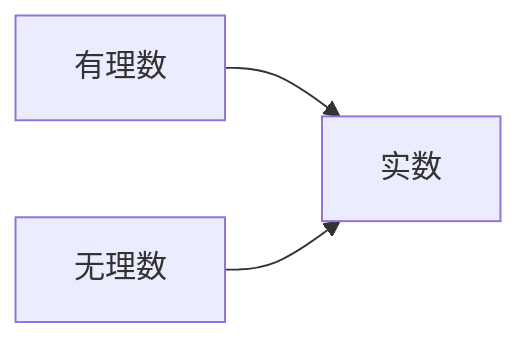
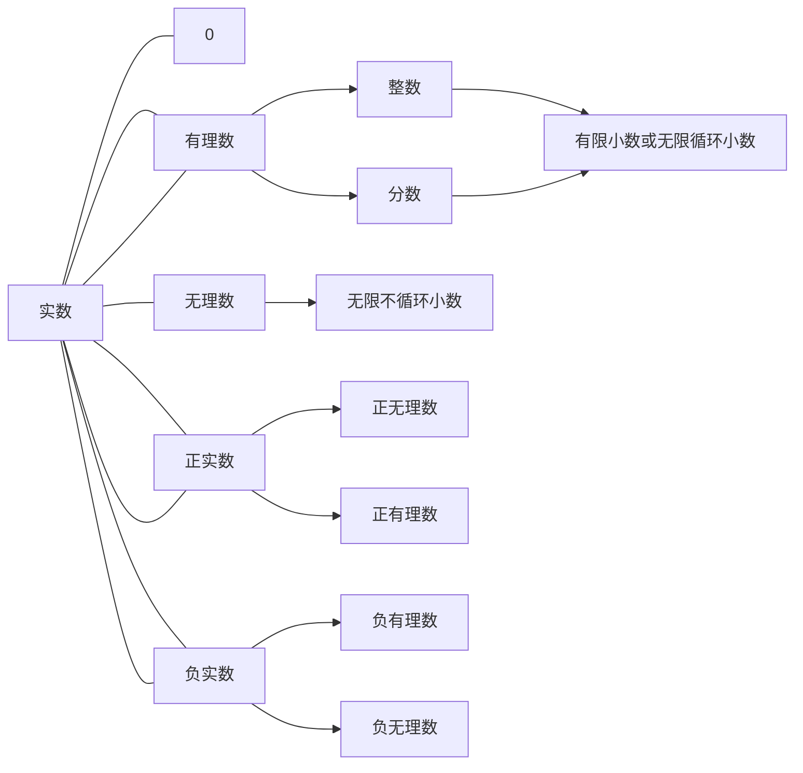

# 初中数学

## 有理数

### 正数和负数

0以外的数分为正数和负数，0 不是正数，也不是负数。

### 有理数

正整数**N***,0,负**整数**统称**整数**,正分数,和负分数,统称**分数**
整数和分数统称**有理数Q**

有符号不同的两个数互为**相反数**
数轴上表示数a的点与原点的距离叫做数a的**绝对值** 记作 $|a|$

**绝对值的定义:** 一个正数的绝对值是它本身,一个负数的绝对值是它的相反数  0的绝对值是0

1. 正数大于0,0大于负数,正数大于负数

2. 两个负数,绝对值大的反而小

   

### 有理数加法法则

1. 同号两数相加,取相同的符号,并把绝对值相加.
2. 绝对值不相等的异号两数相加,取绝对值较大的加数的符号,并用较大的绝对值减去较小的绝对值,互为相反数的两个数相加得0
3. 一个数同0相加,扔得这个数.

两个数相加,交换加数的位置和不变

三个数相加,先把前两个数相加,或者先把后两个数相加,和不变

### 有理数减法法则

1. 有理数减法可以化转为加法进行.

   **减去一个数,等于加上这个数的相反数**

   $a-b=a+(-b)$

2. 引入相反数,加减混合运算可以统一为加法运算

   $a+b-c=a+b+(-c)$

同名相除, 同号两数相减**括号前为被减数**的符号,括号内为被减数的**绝对值减去减数的绝对值**

$(+5)-(+3)=+(5-3)$.

$(-5)-(-3)=-(5-3)$.

异明相益,异号两数相减,**括号前为被减数**的符号,括号内为被减数的绝对值加减数的绝对值

$(+5)-(-3)=+(5+3)$.

$(-5)-(+3)=-(5+3)$.

正无入负之,负无入正之, 0减正得负,0减负得正

$0-(+3)=-3$

$0-(-3)=+3$

### 有理数乘法法则

两数相乘,同号得正,异号得负,并把绝对值相乘.

任何数同0相乘都得0

乘积为1 的两个数互为倒数

两数相乘,交换因数的位置,积相等.

$ab=ba$

三个数相乘先把前两个数相乘或者先把后两个数相乘,积相等

$(ab)c=a(bc)$

一个数同两个数的和相乘,等于把这个数分别同这两个数相乘再把积相加

$a(b+c)=ab+ac$

### 有理数除法法则

处以一个不等于0的数,等于乘这个数的倒数

$a \div b = a $ $1 \over b$$(b \ne 0)$

两数相乘,同号得正,异号得负,并把绝对值相乘.

0除任何数都得0

### 有理数乘方

求$n$ 个相同因数的积的运算,叫做**乘方**,

结果叫幂(power) 在 $a^n$ 中 $a$ 叫做**底数**,$n$ 叫做**指数**

读作$a$ 的$n$ 次幂 或者 次方

负数的奇次幂是负数,偶次幂是正数

有理数混合运算注意:

1. 先乘方,在乘除,最后加减
2. 同级运算,从左到右进行
3. 有括号,先算括号内的运算,按小括号,中括号,大括号依次进行

10 的 $n$ 次幂 等于 1 后面有 $n$ 个0 .

## 一元一次方程

含有未知数的等式 叫做方程(equation)

含有一个未知数$(x)$ 的方程叫做一元一次方程

#### 等式的性质

1. 等式两边加或者减同一个数或者式子,结果仍然相等.

   $a=b,a\pm c=b \pm c$

2. 等式两边同乘同一个数或者处以同一个不为0的数结果仍然相等

   $a=b,ac=bc;$

   $a=b,(c \ne 0),$$a \over c$=$b \over c $

   

#### 一元一次方程

$x+2x+4x=140$

含有$x$ 的项 **合并**得

$x+2x+4x=(1+2+4)x=7x$

$x+2x+4x=140$

$7x=140$

系数化1 [^系数]

$x=20$

[^移项]:把等式一边的某项变号后移到另一边,叫做移项

$3x+20=4x-25$

$3x-4x=-25-20$[^移项]

$-x=-45$

$x=45$

$3x+5(138-x)=540$

去括号:

$3x+690-5x=540$

移项:

$3x-5x=540-690$

$-2x=-150$

$x=75$

 

### 系数

[^系数]: 系数的字面意思：有关系的数字。比如说代数式"3x"，它表示一个常数3与未知数x的乘积，即表示3×x，等于x+x+x。“3x”代表一个数值，这个数值只与x有关系，是什么关系呢？“3”便是说明了关系——是3个它相加的和。所以，“系数”可以解释为“有多少个未知数（相加的和）系数 如abc的系数是1，次数是3。  [1] 。

在一项中，所含有的未知数的指数和称为这一项的次数。

不含未知数的项，称为常数项。例如：1，2，3，100等这样的数。常数的次数是0。有理数分为正有理数、零、负有理数、整数、分数

在多项式中含有字母的项，该项的[整数部分](https://baike.baidu.com/item/整数部分)称作是该项的系数，不含字母的项称作[常数项](https://baike.baidu.com/item/常数项)。

[常数](https://baike.baidu.com/item/常数)是指固定不变的数值。就是除了字母以外的任何数，包括正负整数和正负小数、分数、0和无理数（如π）。如多项式：4ab-5c+6d-7中，4、-5、6分别是含有字母的项ab、c、d的系数，而-7这项不含有字母，所以称作为常数项；

如式子中没有数字，系数的默认情况下是为1或-1。例：-x 系数：-1；x系数：1；

在单项式中，字母的系数默认为1。例：a的系数是1。

次数指单项式中所有字母的指数的和；

分数的系数，例：-3xy÷2π的系数为-3÷2π ；

## 三角形

1. 两个角的和是 $90^{\circ}$ 就说这两个角互为 **余角,**

2. 如果两个角的和等于$180^{\circ}$ 就说这两个角互为**补角**

3. 三角形的内角和等于$180^{\circ}$

4. 三角形的一个外角等于与它不相邻的两个内角的和

5. 三角形的一个外角大于与它不相邻的任何一个内角

6. $n$边形的内角和等于$(n-2)\bull$$180^{\circ}$  

7. 如果四边形的一组对角互补,那么另一组也互补

8. 多边形的外角和等于$360^{\circ}$

   

## 二元一次方程[^二元一次方程]

[^二元一次方程]:每个方程含有两个未知数($x,y$) 且未知数的指数都是1 这样的方程叫 二元一次方程

$x+y=22$

$2x+y=40$

消元:削去一个未知数

### 带入消元法,简称带入法

$x-y=3$

$3x-8y=14$

消元

$x=y+3$

带入式2

$3(y+3)-8y=14$

$y=-1$

带入式1

$x=2$

### 加减消元法

两个二元一次方程中同一未知数的系数相反或相等时,将两个方程里的两边分别相加或相减,就能削去这个未知数,得到一个一元一次方程

a 3x+4y=16   

b 5x-6y=33

c 9x+12y=48  a*3

d 10x-12y=66  b*2

19x=114   c+d

x=6 

带入 a 3*6+4y=16

4y=-2

y=- 1/2

## 不等式与不等式组

用$<> \ne$  表示的式子叫做不等式,解的集合简称解集

未知的次数是1 的不等式,叫做一元一次不等式

不等式两边加减同一个数不等号的方向不变

如果$a>b$ 那么 $a +-c >b +-c$

## 实数

### 平方根

如果一个正数$x$的平方等于$a$ ,$x^2=a$   那么这个正数$x$叫做$a$ 的**算术平方根** 

$a$ 的算术平方根记作 $\sqrt a$  读作根号$a,a$叫做被开方数

0的平方根是0

 一个数的平方等于$a$ 那么这个数叫做a的平方根或者二次方根 $x^2=a$  $x$叫做 $a$ 的平方根

求一个数$a$的平方根叫做开平方

正数的平方根有两个,互为相反数, 正数的平方根是正数,负数的平方根也是正数 任何一个数的平方根都不会是负数

### 立方根

如果一个正数$x$的立方等于$a$ ,$x^3=a$   那么这个正数$x$叫做$a$ 的**立方根** 或者三次方根

求一个数$a$的立方根叫做开立方 $\sqrt[3]2$

### 无理数

无限不循环小数叫做**无理数**

有理数和无理数统称为实数

一个正实数的绝对值是它本身,一个负实数的绝对值是它的相反数,0的绝对值是0

## 一次函数

1. 变量 数值变化的量称为**变量** ,数值始终不变的称为**常量**
2. 一般这一个变化过程中,如果有两个变量$x与y$ 并且对于$x$的每一个确定的值,$y$都有唯一确定的值与其对应,那么说$x$是**自变量,**$y$是$x$的函数.当$x=a时y=b,那么b叫做当自变量的值为a时的$**函数值**​

3. $y=kx(k是常数,k \ne 0)$的函数叫做正比例函数,其中$k$ 叫做比例系数

正比例函数的$y=kx(k是常数,k \ne 0)$图像是一条经过原点的直线,称他为直线$y=kx(k是常数,k \ne 0)$ 

当$k>0$ 时 直线$y=kx$ 经过第三一象限.从左向右上升,随着x的增大y也增大;

当k<0时 直线y=kx 经过第二四象限从左向右下降,随着x的增大y反而减小

4. 如 $y=kx+b(k,b是常数,k \ne 0)$ 的函数,叫做一次函数 
5. 当b=0时,y=kx+b 即 y=kx 正比例函数是一中特殊的一次函数

## 全等三角形

形状大小相同的图形放在一起能够完全重合,叫做全等形

两个完全能够重合的三角形叫做全等三角形

重合的顶点叫做对应顶点,重合的边叫做对应边,重合的角叫做对应角

对应边,对应角 都相等

角的平分线线性质,角的平分线上的点到角的两边都距离相等

## 轴对称

## 等腰三角形

两个底角相等

顶角平分线,底边上的中线,底边上的高相互重合

如果一个三角形有两个角相等,那么这两个角所对的边也相等,简写等角对等边

三条边相等到三角形叫做等边三角形,三个内角都相等每一个角都等于60度

有一个角是60° 的等腰三角形是等边三角形

在直角三角形中，如果一个锐角等于30° 那么它说对的直角边等于斜边的一半

## 整式的加减

合并同类型，

几个整式想加减，通常用括号把每一个整式括起来，在用加减号连接，然后去括号合并同类项

同底数幂相乘，底数不变，指数相加

幂的乘法，底数不变，指数相乘

积的乘方，等于把积的每一个因式分别乘方，再把所得的幂相乘

单项式与单项式相乘，把他们都系数，相同字母分别相乘，对于只在一个单项式里含有的字母，则连同它的指数作为积的一个因式

单项式与多项式相乘，就是用单项式去乘多项式的每一项，再把所得的积相加

多项式与多项式相乘，先用一个多项式的每一项乘另一个多项式的每一项，再把所得的积相加。

### 乘法公式

### 平方差公式

#### 乘法的平方差公式

两个数的和与这两个数的差的积,等于这两个数的平方差

$(a+b)(a-b)=a^2-b^2$

#### 完全平方公式

**两数和(或差)的平方，等于它们的平方和加(或减)上它们的积的2倍。**

$（a+b）²=a²﹢2ab+b²$

  $﹙a－b﹚²=a²﹣2ab+b²$ 

去括号:$a+(b+c)=a+b+c;a-(b+c)=a-b-c$

加括号:$a+b+c=a+(b+c);a-b-c=a-(b+c)$

添加括号时,如果括号前面是正号,括到括号里的各项都不变符号,如果括号前面是负号,括到括号里的各项都改变符号

首平方，尾平方，首尾相乘放中间。

或首平方，尾平方，两数二倍在中央。

也可以是：首平方，尾平方，积的二倍放中央。

同号加、异号减，负号添在异号前。（可以背下来）

**即**

**（注意：后面一定是加号）**

### 整式的除法

同底数幂相除,底数不变,指数相减. $a^m \div a^n = a^{m-n}(a \ne 0, m,n 都是正整数,且m>n)$

任何不等于0的数的0次幂都等于1 $a^0 =1 (a \ne 0)$

单项式相除,把系数与同底数幂分别相除作为商因式,对与只在被除式里含有的字母,则连同它的指数作为商的一个因式

多项式处以单项式,先把这个多项式的每一项除以这个单项式,再把所得的商相加

### 因式分解

$x^2+x=x(x+1)$

$x^2-1=(x+1)(x-1)$

把一个多项式化成了几个整式的积形式,叫做多项式因式分解,也叫多项式分解因式

#### 提公因式法

**具体方法：**当各项[系数](https://baike.baidu.com/item/系数)都是[整数](https://baike.baidu.com/item/整数)时，公因式的系数应取各项系数的[最大公约数](https://baike.baidu.com/item/最大公约数)；字母取各项的相同的字母，且各字母的指数取次数最低的；取相同的多项式，且多项式的次数取最低的。

如果多项式的第一项是负的，一般要提出“**-**”号，使括号内的第一项的系数成为正数。**提出“-”号时，多项式的各项都要变号。**

例题：

**口诀：找准公因式，一次要提净；若搬全家走，留1把家守；提正不变号，提负就变号。**

提取公因式是[乘法分配律](https://baike.baidu.com/item/乘法分配律/2285256)的逆运算，其最简形式为：ma+mb+mc=m(a+b+c)。

#### 公式法

$a^2-b^2=(a+b)(a-b)$

两个数的平方差,等于这两个数的和与这两个数的差的积

## 分式

分式的分子与分母与同乘或者处以一个不等于0的整式,分式的值不变.

分式乘分式,分子的积作为积点分子,分母的积作为积的分母

分式除以分式,把除式的分子分母颠倒位置后与被除式相乘

$a \over b $$\bull $ $c \over d$$=$$ a\bull c \over b \bull d$

$a \over b $$\div $c $\over d$=$a \over b$ $\bull$ $d \over c$ = $a \bull d \over b \bull c$

## 反比例函数

## 勾股定理

$a^2 + b^2 =c^2$  直角三角形

经过证明被确认正确的命题叫做定理

## 二次根式

## 一元二次方程

## 概率初步

随机事件

概率的意义

事件A发生的频率 $m \over n $会稳定在某个常数$p$附近 常数$p$ 是事件A的概率 记作 $P(A)=p$

$P(A)=m \over n $